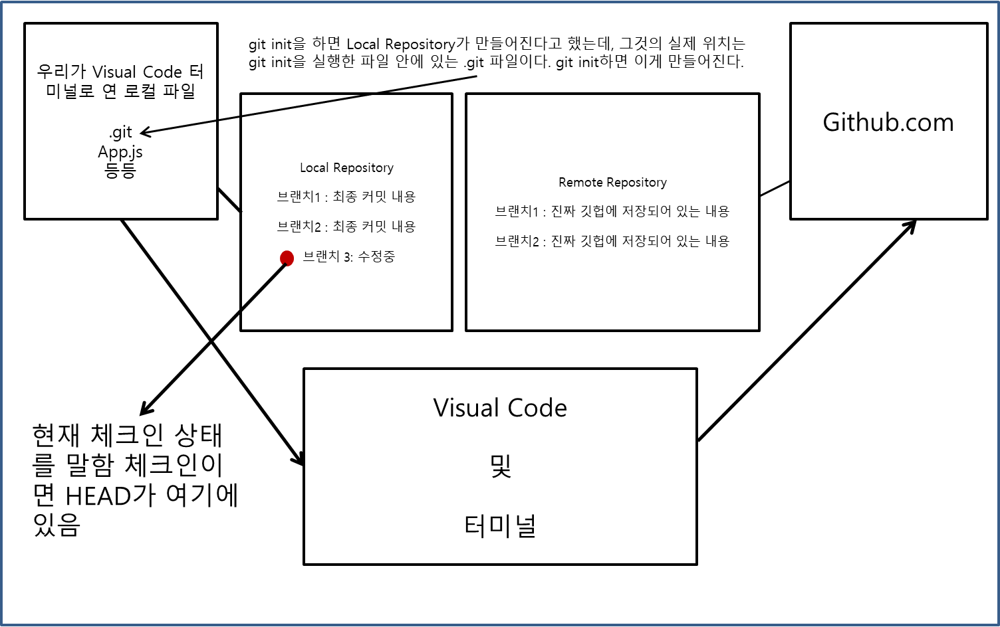

# 1. Repository와 Remote
 

* git init
 깃은, 자기가 깃헙 서버에 올리기 전에 로컬에 중간 서버같은 느낌의 '임시 저장소'를 만드는데, 이것이 바로 repository이다. 쉽게 생각하면 로컬과 github.com 사이에 있는 서버라고 생각하면 된다. 위 명령어는 그 저장소인 Repository를 만드는 것을 말한다. git init을 하면 이 명령어를 시행한 폴더 내에 .git이라는 폴더가 생기는데, 이것이 바로 그 Repository이다.
   

* git remote -v
 그리고 그 Repository는, 자신이 담고 있는 내용을 github.com의 어디에 올릴지를 알기 위해서 Remote라는 일종의 '라우터'같은 개념을 가진다. 다시 말하면 github.com에 저장할 저장경로를 알고 있어야 한다는 뜻인데, 예를 들면 "https://github.com/norrard148/git-master.git"와 같은 것을 지정하는 것이 Reomote이다. 그리하여 내가 등록한 주소 목록을 알게 해주는 것이 git remote -v 이다. 아무것도 안한상태로 git remote -v하면 대부분 예전에 해놓았던 것이 뜨거나 아무것도 안 뜬다.
   

* git remote -v
 이것은 한 프로젝트 폴더의 Repository에 지정되어 있는 remote를 확인하는 법이다.
   

* git remote add origin "주소"
 이것은, 호칭이 origin이면서 주소는 "주소"인 라우터(쉽게 생각하면 저장 경로)를 만들으라는 것이다.
   

* git remote add awesome "주소"
 이것은, 호칭이 awesome이면서 주소는 "주소"인 라우터를 만드는 것이다.
   

* git remote rename awesome cool
 이것은, awesome 이라는 호칭의 라우터를 cool이라는 호칭으로 교체하라는 것이다.
   

* git remote show cool
 이것은, 라우터인 cool을, 조금 자세하게 설명해서 보여주라는 것이다.
  

<h1>2. git clone</h1>
 

* git clone "주소"
 내가 프로젝트를 진행하고 싶은 폴더에서 깃헙의 한 프로젝트를 불러오는 명령어다. 이러면 깃헙의 한 프로젝트(repository)가 불러와진다. 다만, git clone은 git init을 하지 않아도 된다. 그 이유는 불러오는거지 repository를 만들어 올리는 것은 아니기 때문이다.
  

* git clone과 git init 및 git remote의 차이를 회고해보자.
  

<h1>3. git add & git commit & git push</h1>
 

* git status
 git은, 지속적으로 git repository가 만들어진 해당 폴더 속 파일들의 '마지막 최종 상태'를 살피고 있다. 그리하여 내가 어떤 것을 수정하게 되고 저장 ctrl+s를 누르는 순간, 그것은 수정된 것이 되고 git은 가장 마지막으로 수정되었던 상태와 현재 수정된 상태를 비교대조한다. 그리하여 조금이라도 변형이 일어나게 되면 이를 알아차리는데, 다만 그 변화를 유의미하다고 받아들이도록 만들기 위해서는 그 변화를 실질적으로 감지하도록 하게끔 해당 파일을 untracked 상태에서 tracked 상태로 전환시켜야 한다. 다시 말해 git이 그 파일을 계속 '추적'하게 하는 것이다. 그리하여 git init으로 인해 로컬 레파지토리가 생긴 '폴더' 내의 파일들 중 어떤것이 untracked이고 어떤 것이 tracked인지를 확인할 수 있는 것이 git status이다. 또한, git status는 untracked 말고도 unmodified, modified, staged 단계적 상태 역시 알려준다.
   

   

* git add
 우리의 프로젝트 폴더 내에 tracked되어 있는 모든 파일은 수정되는 순간 기본적으로 unmodified에서 modified 상태가 되는데, 이 modified가 staged 상태로 되어야 그 파일이 비로소 Repository에 저장된다. 다시 말해, staged 상태는 .git 폴더 안에 우리의 수정 내용이 저장되었음을 말한다. staged되는 즉시 커밋이 되었다고 하며, 변경상태는 Repository에 저장되고 다시 파일들은 unmodified 상태로 돌아간다. 그리하여, 파일의 untracked 에서 tracked 상태로 바꿔주는 역할을  하는 것이 git add이다. git add를 쉽게 설명하자면, add하고자 하는 파일의 변화를 '받아들이고 지켜보고 있어라'라는 신호를 깃에게 보내는 것이라고 생각하면 된다. 그러면 깃은 add된 파일의 변화를 유의미한 것으로 받아들여서 그것들만 보게 된다. 보통, 우리의 프로젝트 폴더안에 있는 파일 전부를 tracked 상태로 켜주기 위해 git add . 를 많이 쓴다.
   

* git commit
 그럼 그 modified로 켜진 상태의 파일을, staged 상태, 즉 게시 상태까지 해주는 명령어가 바로 위에 쓴 git commit 이다. git commit 명령어를 통해 staged 된 파일 내용들은, Repository가 담아서 기억하게 된다. 그리하여 이 기억은 새롭게 커밋을 하기 전까지는 그대로 남은채 브랜치별로 Repository에 남아 있게 된다. 정확하게는 git commit -m " " 로 써야 한다.
   

* git push Remote이름 Remote내Branch이름
 최종적으로 git commit 을 통해 Repository 구석에서 기다리고 있던 파일 수정 내용들이 git push를 통해 깃헙 서버로 보내지게 된다. Repository의 내용을 github.com으로 보내는 역할을 하는 명령어라고 볼 수 있다.
  

# 4. Branch
 

* 들어가기 전에 앞서, 위에 다루어진 내용을 좀더 구체적으로 다루고 출발해야 한다. 위에서 git init으로 Repository라는 일종의 '중간 서버'를 만든다고 했다(정확히는 중간 저장소). 그리고 그 중간 서버가 어떻게 움직여야 되는지를 알려주는 라우터 기능은 'remote'가 한다고 했다. 그런데, 그 Repository는 엄밀하게 말하면 Local Repository와 Remote Repository로 나뉘어져 있다. Local Repository는 로컬인 내 컴퓨터에서 만들어진 Repository를 말하고(.git파일), Remote Repository는 깃헙에 진짜 올라와져있는 깃헙 서버내 Repository를 말한다. 도식은 이러하다.
  Visual Code 상에 열려 있는 파일--->Local Repository--->bash 같은 터미널--->Remote Repository--->Github Server  그리하여, 3단원을 좀 더 자세히 이야기해보자면, git add 에서 git commit의 과정을 통해 이루어지는 (untracked->tracked->unmodified->modified->staged)의 일련의 과정은 'Local Repository'에서 이루어지는 과정이라고 할 수 있다. 후에 다루겠지만, 사실 모든 commit이 작은 브랜치라고 할 수 있으며, 우리가 사용하는 기존의 브랜치 개념은 이 커밋들을 모아놓은 큰 '커밋함'이라고 볼 수 있다. 그리하여, 브랜치는 Local Repository를 사용하기 위한 일종의 하드디스크의 파티션이라고 생각할 수 있으며, 혹은 책꽂이 칸칸이 내지 호텔에 있는 룸들이라고 생각해도 좋다. 우리가 각각의 칸칸이를 사용하기 위해서는 반드시 그 칸칸이에 직접 들어가야 하는데, 그 개념을 체크인한다고 한다. 체크인이 되어 있는 칸만을 변화시키고 수정할 수 있기 때문에, 수정하고 싶은 칸(브랜치)이 있으면 그 칸으로 우선 체크인해야 한다. 호텔룸을 사용하는기 위해선 먼저 호텔룸 밖에서 카드로 찍어야 하는 것이라고 생각하면 좋다.
   

* git branch 브랜치이름
 이것은, 브랜치를 만드는 명령어다. 하지만 명심해야 할 것은, 이 명령어는 '내 로컬 repository'에서 만들어지고 마는 것 뿐이다. 이것이 완벽하게 Remote Repository까지 전달되기 위해서는 git push Remote이름 Branch이름 하면 된다. git push Remote이름 Branch이름은, commit이 딱히 없으면 단순히 Remote Repository에 브랜치를 만들으라는 명령이 된다.
   

* git branch
 'Local repository'의 branch 목록을 나열하라는 명령어이다.
   

* git branch -r
 'Remote Repository'의 branch 목록을 나열하라는 명령어이다.
   

* git branch -a
 이건 Local 뿐만 아니라 Remote Repository의 branch 목록을 보이라는 명령어이다.
   

* git checkout youngjae
 youngjae 라는 Local Repository 안에 있는 브랜치로 체크인 하라는 명령어입니다.
  

## 여기서 질문! 그럼 나의 Local Repository와 Remote Repository 안에 있는 branch는 서로 이름이 달라도 되는걸까요? 달라도 되는거면 어떻게 서로 이어주는 거죠?
 

* git branch --set-upstream-to RemoteRepository이름/RemoteRepository안에있는Branch이름
 달라도 됩니다! 그리고 연동은 위 코드대로 합니다. 예제는 아래에 있습니다. 단, 연동하기 위해서 미리 checkout을 통해 연동하고싶은 로컬 브랜치로 접속해 놓아야 합니다.
 ex) git branch --set-upstream-to origin/youngjae
 여기서 더 알아야 할 것은, git branch 브랜치이름 해서 만들고 난 다음 git push origin 브랜치이름 으로 깃헙측 Repository에 브랜치까지 만들면 자동으로 둘이가 연동됩니다. 이것은, git remote show origin 해보면 확인해볼 수 있습니다.
   

* git checkout -b sangwoo
 Sangwoo라는 Local Repository 내 브랜치(이하 로컬 브랜치로 부름)로 체크인하되, 그러한 브랜치가 없으면 만들어서 체크인하라는 명령어입니다.
   

* git branch -d Branch이름
  이 명령어는 Local Branch를 삭제하는 명령어입니다. 대신, 이 명령어는 지우고 싶은 Local Branch로 체크인해서 접속한 상태여야 가능합니다.
   

* git branch -D 브랜치이름
  이 명령어는 다른 로컬 브랜치 접속상태에서도 딴 로컬 브랜치를 없앨 수 있습니다.
  

 ## 그럼 Local Repository에 있는 Branch 말고, Remote Repository 안에 있는 Branch는 어떻게 없애나요!
  

 * git push origin :브랜치이름
  이러면 없어집니다! 대신 주의할 점은, Remote Repository를 없앤다는 것은, 깃헙 사이트에서 브랜치 단추 눌러서 열리는 그 브랜치 목록에서 해당 없애고 싶은 브랜치를 없애겠다는 말입니다. 다시말해서, 진짜로 브랜치를 없애겠다는 말이므로 주의해서 사용해야 합니다.
  

# 5. 실습 1
 

* git clone https://github.com/norrard148/git-master.git

* cd git-master

* git init
   

 ## 이제, 깃헙 remote repository에 있는 master, youngjae, hangyeol, sangwoo 브랜치들에 상응하는 local branch를 네개 만들고, 완전히 그것들을 동기화해봅시다. 헛갈리지 않기 위해 로컬 브랜치 이름은 각각 master, youngjae, hangyeol, sangwwo로 합니다. 그리고 체크인을 하면, 각각 브랜치의 내용들이 비쥬얼 코드에 바뀌어서 자동으로 뜰 수 있게끔 해봅시다. 정확히 각각 브랜치에 있는 내용들만 뜰 수 있도록 해야 하며, 다른 브랜치로 체크아웃했더니 이전에 있던 파일이 남아있거나 하면 안됩니다. 참고로, youngjae, hangyeol, sangwoo 브랜치엔 오직 app.js 파일 하나만 있고, master 브랜치에는 app.js, git.md, 사진1.png, 노란연필.jpg가 있습니다.
 

* 정답

* git branch youngjae

* git branch hangyeol

* git branch sangwoo

* git checkout master  //master에 체크인이 안되어 있을 경우에 하도록 합니다.

* git pull origin master

* git add .

* git commit -m ""

* git checkout youngjae

* 모든 파일을 지웁니다. 지우는 이유에 대해 생각해보아야합니다!

* git pull origin youngjae

* git add .

* git commit -m ""

* git checkout hangyeol

* git pull origin hangyeol

* git add .

* git commit -m ""

* git checkout sangwoo

* git pull origin sangwoo

* git add .

* git commit -m ""
  

## 여기까지 성공했다면, 여러분은 하나의 프로젝트 폴더 안에서 local repository를 통해 깃헙 remote repository에 있는 4개의 브랜치를 동시에 작업할 수 있는 것이 됩니다! 주의할 점은, 항상 다른 로컬브랜치로 체크아웃하려면 현재 체크인된 브랜치의 변경상태를 반드시 git add & git commit 까지 해서 Local Repository에 저장(staged)해놓아야 한다는것입니다!!! 이렇게 해야만 가능한 이유는, 저장을 안하고 넘어가는 실수를 방지하기 위해 git이 이렇게 제약을 걸어놓았기 때문입니다. 기타 주의할 점은 몇가지가 있는데 끝부분에 다루도록 하겠습니다. 
 

# 6. 실습 2 
 

* 시작하기에 앞서, 모든 로컬 브랜치는 항상 git checkout 브랜치이름 를 통해 자신이 소환되어 체크인이 되면, 자신의 가장 마지막에 된 최종 커밋을 띄워줍니다. 쉽게 말하면, 체크인한 브랜치의 최종 커밋이 비쥬얼 코드에 뜬다는 것을 말합니다. 그래서 만약 새로 만든 로컬 브랜치로 체크인을 하게 되면, 당연히 최종 커밋된 것이 없겠죠? 그럴 땐 전에 접속되어 있던 로컬 브랜치의 내용을 그대로 그냥 띄워줍니다. 이제 조금 도식을 정교화해보자면, 이렇습니다.
   

   

## 다소 아리까리 할 수 있는 내용을 확실히 이해하고자 몇가지를 해보고자 합니다. 제가 만들어 놓은 github 프로젝트를 하나 다운받아야 합니다.
 

* git clone https://github.com/norrard148/git-master.git

* cd git-master

* git branch
 아마, master 하나만 있을 겁니다. 왜일까요?
 아까도 말했듯이, 처음 프로젝트를 다운 받으면, 로컬 레파지토리는 텅텅 비어있는 상태입니다. 그래서, Remote Repository는 많은 브랜치가 있음에도 하나도 뜨지 않는 것이죠. 그래서 우리는, 몇개의 로컬 브랜치를 만들어서, 그것을 각각 깃헙측 레파지토리에 연동시켜서 사용하는 법을 익혀 볼 겁니다.
   

* git branch connect-youngjae

* git checkout connect-youngjae

* git branch --set-upstream-to origin/youngjae

* git pull origin youngjae

* app.js 들어가봅니다.

* console.log("youngjae"); 을 더 써넣습니다.

* git add .

* git status

* git commit -m "md+"

* git push origin youngjae
 이거 하면 오류 생깁니다. 왜일까요?
  그 이유는, git push 자체가 별도의 설정없이 하면 현재 체크아웃 되어 있는 로컬 브랜치랑 깃헙 레파지토리측 브랜치 이름이 '같을 때만 해주거나, 혹은 같은 놈들이 있으면 그놈끼리만 연결해서 해주기 때문입니다. 그래서 그런 것입니다. 그래서 이럴 땐,
   

* git push
 해보면 안내문이 뜨는데, 여기서,
   

* git push origin HEAD:youngjae
 로 하라고 합니다. 이렇게 하면됩니다. 이 방법은, 내가 깃헙에 올리고 싶은 Remote Branch가 있는데 지금 내가 체크인한 로컬 브랜치와는 이름이 다를 때, 브랜치 영역 초월해서 업로딩해버릴 수 있는 명령어이기도 합니다.
   

## 자그럼, 이로써 우리는 로컬 브랜치 connect-youngjae 라는 놈을 만들었고? 그리고 얘를 깃헙 브랜치인 youngjae와 연결짓는 한편, connect-youngjae가 체크아웃 되어 있는 상태에서, 즉 그 브랜치에 들어와 있는 상태에서 깃헙 브랜치 youngjae 내용을 고대로 git pull origin youngjae로 불러와서? 비쥬얼 코드에 띄운 다음?, app.js에서 수정을 하고, git add . git commit -m "" 이런 걸 다하고? 다시 원래 가져왔던 브랜치인 깃헙측 브랜치인 youngjae에 다시 업로딩하는것까지 해보았습니다!
   

# 7. 실습 3
 

## 그러면, connect-youngjae 브랜치에 체크아웃 되어 있는 상태에서, 리모트 브랜치인 sangwoo 브랜치 내용을 불러온다음, 수정을 하고 난 뒤, 이걸 hangyeol 리모트 브랜치에 업로딩 할 수는 없을까요? 가능합니다! 실습해봅시다.
 

* 정답

* git branch
 checkout이 connect-youngjae로 되어 있는 지 확인

* git pull origin sangwoo

* 아무거나 수정해본다.

* git add .

* git commit -m ""

* git push origin HEAD:hangyeol
  

# 8. 실습 4
 

## 그 다음으로는, 새로운 로컬 브랜치를 하나 아무거나 만들어 체크인하고, 들어와있는 로컬 브랜치를 리모트 브랜치인 youngjae와 연동하고, sangwoo 깃헙 브랜치의 내용을 불러온 다음, 수정을 하고, 이걸 새로운 리모트 브랜치인 gitmaster를 만들어 거기에 넣어보도록 합시다!
  

# 9. 끝
 

## 이로써, 우리에게 정말 필요한 내용은 끝이 납니다. 감사합니다. 하지만 참고로 알면 좋은것 하나 더!
 

* git fetch 와 git pull 의 차이점은 무엇일까?

